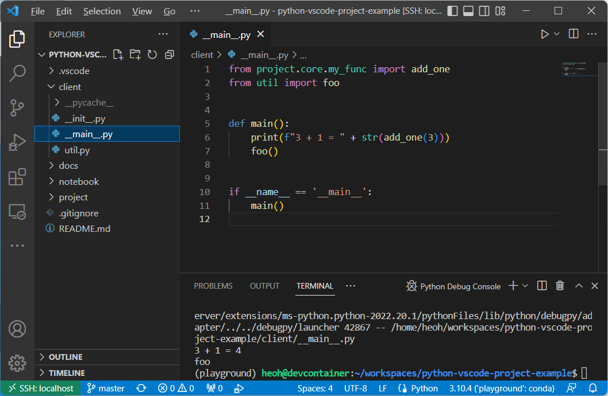

# Python VSCode Project Example

Python project with Visual Studio Code example

## Directory Structure

- `project`: Main package
  - `core`: Contains core modules
  - `test/core`: Contains tests for core modules
- `client`: Python example using main package
- `notebook`: IPython notebook example using main package

## Features

### Testing

This is compatible with the **Testing** feature of the VSCode Python extension.

### Run client code

You can do **absolute import** the `project` package into other Python client code or notebooks.
(e.g. `import project`)

